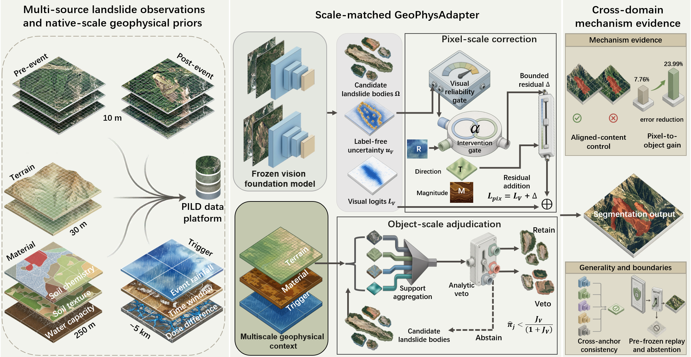
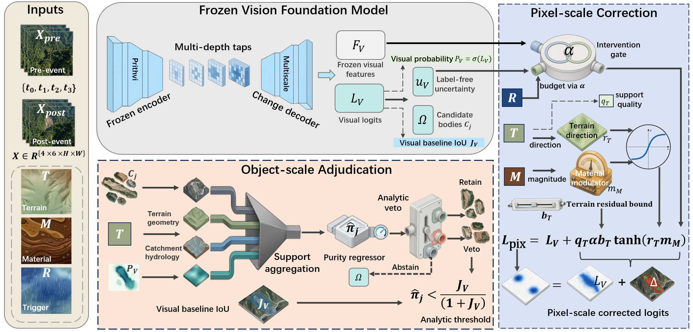
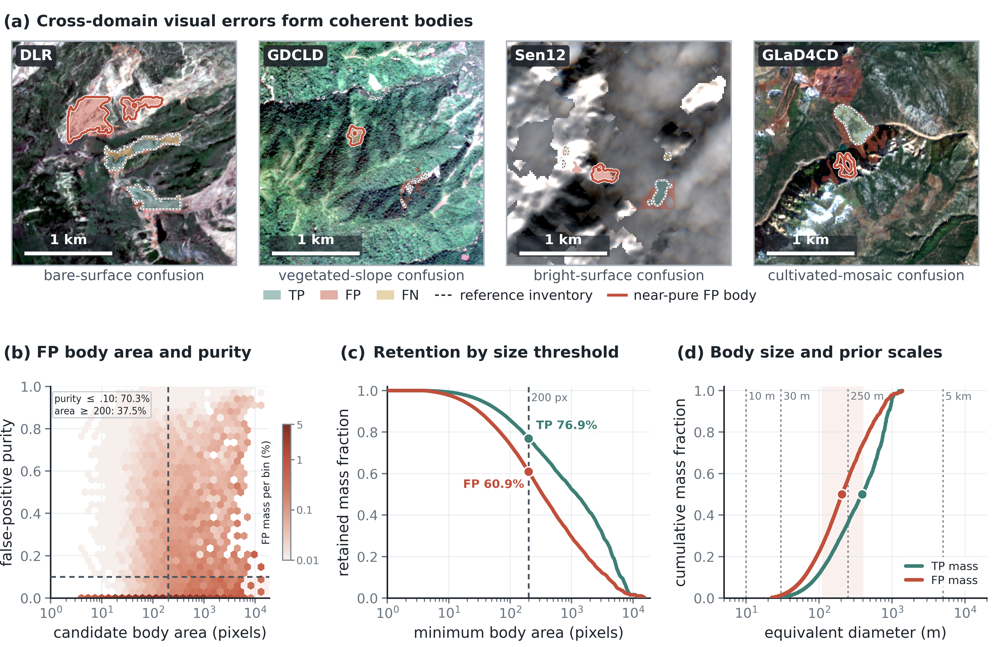
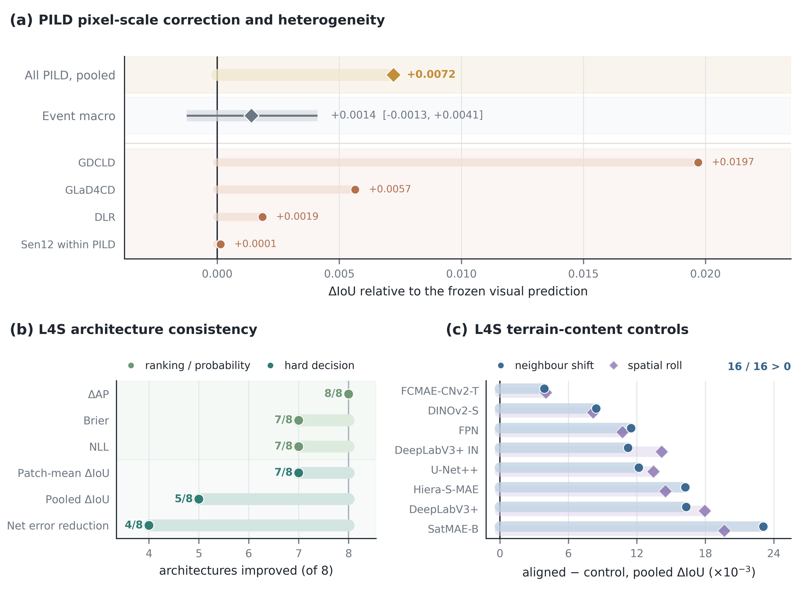
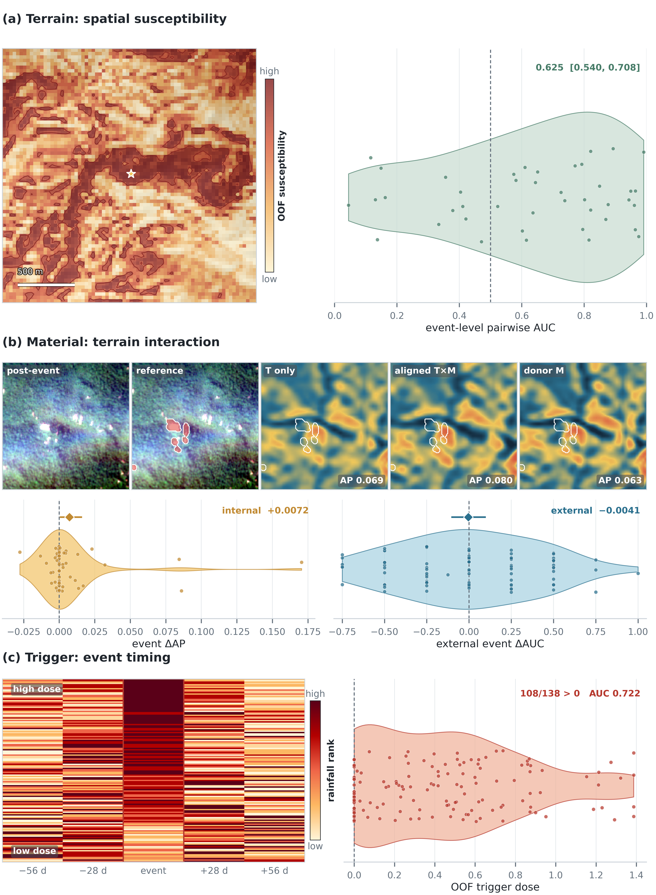
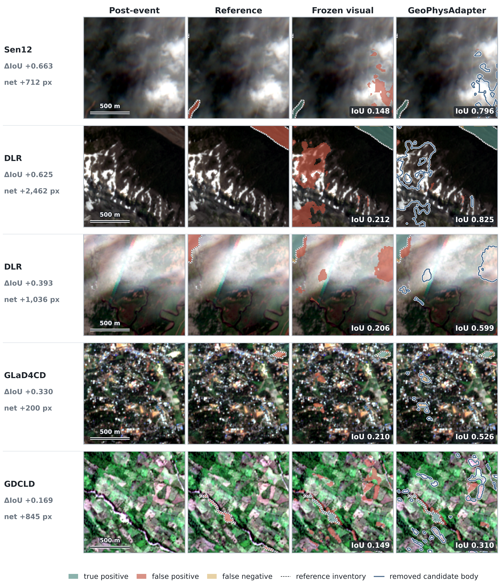
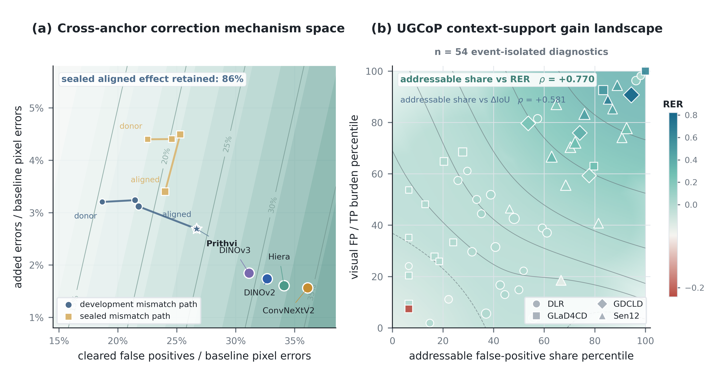
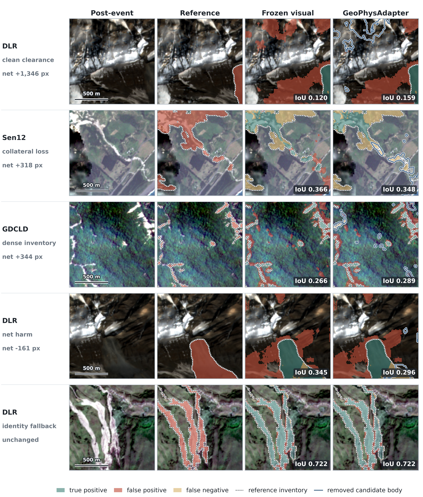

# GeoPhysAdapter

Official code for:

**GeoPhysAdapter: Scale-Matched Geophysical Adaptation for Cross-Domain Landslide Mapping with Vision Foundation Models**

## Overview

GeoPhysAdapter freezes a vision foundation model (primary anchor: Prithvi-EO-2.0-300M-TL) and updates its prediction with three geophysical priors:

- Terrain: densely aligned correction direction
- Material: bounded regional amplitude modulation
- Trigger: event-level intervention dose

The update runs at both the pixel scale and the candidate landslide-body scale. If physical support is missing or invalid, the frozen visual prediction is kept as is.

## Dataset (PILD)

The paper uses a four-source PILD corpus of **7,890 samples** and **55 canonical events**.  
This repository ships the manifests, splits, and protocol summaries. Raw imagery must be downloaded from the original providers.

Full download links, citations, and a step-by-step usage guide: **[docs/DATA.md](docs/DATA.md)**

### Upstream landslide sources

| Source | Samples | Access | Citation |
|---|---:|---|---|
| Sen12Landslides (harmonized) | 4,979 | [Hugging Face](https://huggingface.co/datasets/paulhoehn/Sen12Landslides) | Höhn et al., 2025, [*Scientific Data*](https://doi.org/10.1038/s41597-025-06167-2) |
| GDCLD | 2,334 | [ESSD article](https://doi.org/10.5194/essd-16-4817-2024) | Fang et al., 2024 |
| DLR Landslide Reference | 509 | [Zenodo](https://doi.org/10.5281/zenodo.17007637) | Orynbaikyzy / Martinis et al., 2025, [*GIScience & Remote Sensing*](https://doi.org/10.1080/15481603.2025.2502214) |
| GLaD4CD v1 | 68 | [Zenodo](https://doi.org/10.5281/zenodo.14226448) | Leonardi et al., 2024 |

PILD metadata in this repo:

- `metadata/pild_geo4_qc_v1/` — unified manifest, event-isolated split, QC summary
- `metadata/pild_geo4_qc_native17_v1/` — protocol hashes (Supplement S6)
- Zenodo package: https://doi.org/10.5281/zenodo.19430714

### Quick start with the data

```bash
# 1) environment
conda env create -f environment.yml
conda activate geophysadapter

# 2) download Sen12Landslides harmonized (example)
hf download paulhoehn/Sen12Landslides \
  --repo-type dataset \
  --local-dir ./data_raw/Sen12Landslides \
  --include "data_harmonized/**"

# 3) download DLR / GLaD4CD from Zenodo, and GDCLD via Fang et al. (2024)
#    see docs/DATA.md for links and citation notes

# 4) train after local caches are built
python scripts/xdomain/train_pild_sen12_roleaware_v1.py \
  --manifest metadata/pild_geo4_qc_v1/unified_sample_manifest_geo4_qc_v1.csv \
  --protocol-summary metadata/pild_geo4_qc_v1/summary.json \
  --split metadata/pild_geo4_qc_v1/event_isolated_split_geo4_qc_v1.csv \
  --variant full_tmr \
  --outdir experiments/local_run
```

Geophysical layers (Copernicus DEM, SoilGrids, CHIRPS, etc.) are listed with access URLs in [docs/DATA.md](docs/DATA.md).

## Repository structure

| Path | Contents |
|---|---|
| `scripts/xdomain/` | Training and evaluation code |
| `scripts/` | Figure and analysis utilities |
| `metadata/` | Sample manifests and splits |
| `experiments/revision2026/` | Summary metrics reported in the paper |
| `docs/` | Data guide and figures |

## Installation

```bash
conda env create -f environment.yml
conda activate geophysadapter
```

## Reproducing Supplement S6

| Step | Path |
|---|---|
| Four-source training | `scripts/xdomain/train_pild_sen12_roleaware_v1.py` |
| Terrain encoding | `scripts/xdomain/sen12_terrain_v2.py` |
| Material module | `scripts/xdomain/pild_roleaware_material.py` |
| Trigger module | `scripts/xdomain/pild_roleaware_trigger.py` |
| Pixel utility gate | `scripts/xdomain/evaluate_pild_benefit_gate_v1.py` |
| Object-level review | `scripts/xdomain/evaluate_pild_object_veto_final_v1.py` |
| Object-level summary | `experiments/revision2026/pild_object_veto_final_v1/summary.json` |
| Protocol hashes | `metadata/pild_geo4_qc_native17_v1/protocol_summary_geo4_qc_native17_v1.json` |

Model checkpoints are not shipped. Build local caches from the upstream datasets, then run the scripts above.

## Figures

### Figure 1. Conceptual overview



### Figure 2. Global distribution of the 55 canonical events


### Figure 3. Technical framework



### Figure 4. Object structure of cross-domain visual errors



### Figure 5. Pixel-scale adaptation and terrain-content controls



### Figure 6. Native-task evidence for the three priors



### Figure 7. Object-scale correction cases



### Figure 8. Cross-anchor reproduction and UGCoP landscape



### Supplementary Figure S1. Object-scale behavior spectrum



## Citation

If you use this code or the PILD assets, please cite the paper, the Zenodo DOI, and the upstream datasets listed in [docs/DATA.md](docs/DATA.md).

## Contact

Please open a GitHub issue for questions about the code or data links.
