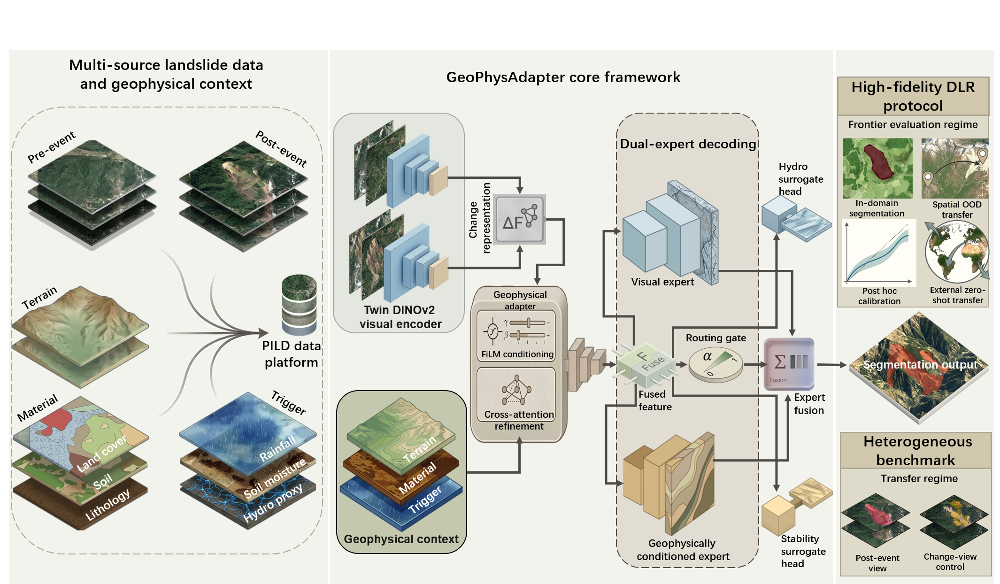
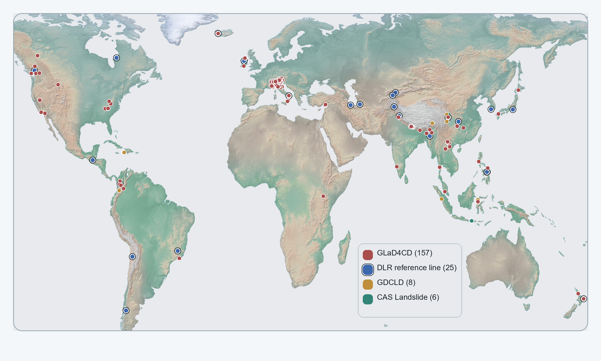
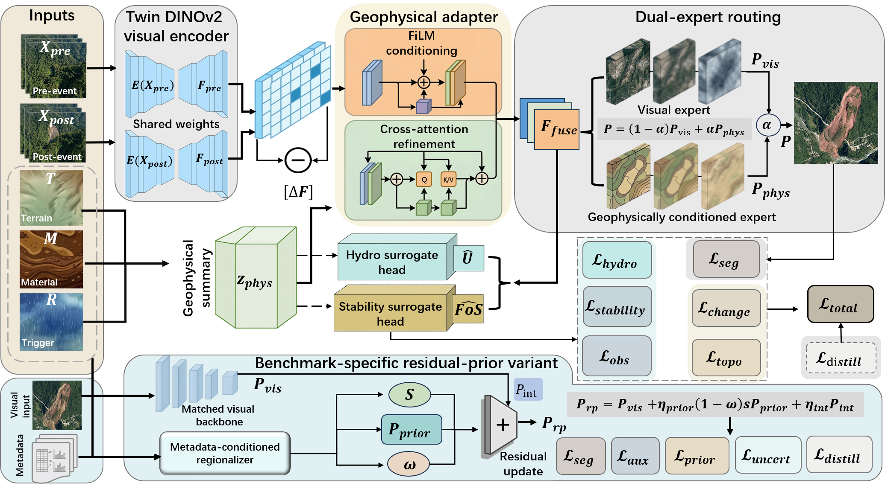

# GeoPhysAdapter and the Physics-Informed Landslide Dataset (PILD)

This repository contains the code, benchmark metadata, and release assets for **GeoPhysAdapter**, a physically structured adaptation framework for cross-domain landslide mapping, and **PILD**, a multi-source benchmark for studying transfer under geographic-context mismatch.

The public repository is organized as an English-only release. Local raw-data mirrors, paper-specific submission packages, and heavyweight experiment caches are intentionally excluded.

## Repository Scope

This repository currently exposes:

- training and evaluation scripts needed to reproduce the paper-level results
- protocol manifests, split definitions, and release-safe metadata
- figure-rendering scripts for the main paper and supplementary material
- release documentation for the public PILD data bundle

This repository does **not** redistribute:

- full upstream raw imagery
- mixed-license environmental rasters
- private mirrors or local cache tensors
- paper-specific submission workspaces

## Repository Layout

- `scripts/`: training, evaluation, figure-rendering, and release-preparation scripts
- `metadata/`: manifests, splits, checksums, and supporting metadata
- `docs/`: public-facing documentation and figure assets
- `release_prep/`: release package templates for the public PILD dataset bundle

## Getting Started

Create the recommended environment:

```bash
conda env create -f environment.yml
conda activate geophysadapter
```

Representative paper-level scripts:

- `scripts/render_pild_global_event_map.py`
- `scripts/build_release_assets.py`
- `scripts/render_paper_figures.py`
- `scripts/render_supplementary_figures.py`

## Public Data Package

The curated public data package is prepared under:

- `release_prep/PILD_release_v1/`

It contains:

- event-level metadata
- benchmark protocols and split tables
- documentation for provenance, licensing, and download pointers
- release-safe figure assets and helper scripts

## Representative Figures

### Figure 1. Multi-source data and benchmark framing



### Figure 2. Global event-source distribution



### Figure 3. GeoPhysAdapter architecture



## Reproducibility Scope

The repository is intentionally limited to the code and metadata required to
reproduce the released benchmark protocols, the reported training and evaluation
pipelines, and the paper figures. Local mirrors, heavyweight experiment caches,
and paper-specific drafting workspaces are excluded from the public release.
